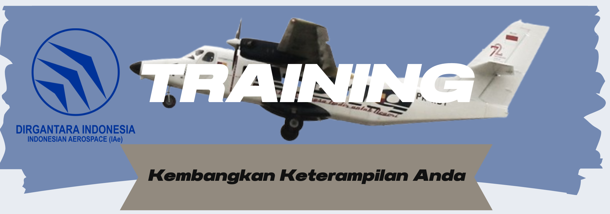
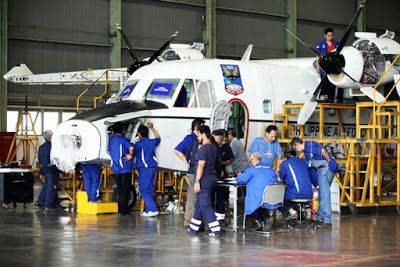

````markdown
# 🚀 Training Project



Aplikasi web Training hasil tugas PKL di PT. Dirgantara, dibangun dengan **Laravel 12** untuk manajemen pelatihan, sertifikat, dan riwayat peserta.

[](https://laravel.com)
[](https://php.net)
[](LICENSE)
[](https://github.com/Yusril0956/Training-Project/commits)
[](https://github.com/Yusril0956/Training-Project/commits)
[](https://github.com/Yusril0956/Training-Project/graphs/contributors)

---

## 📑 Daftar Isi

- [Tentang Proyek](#-tentang-proyek)
- [Fitur Utama](#-fitur-utama)
- [Teknologi yang Digunakan](#-teknologi-yang-digunakan)
- [Screenshot](#-screenshot)
- [Kontributor](#-kontributor)
- [Prasyarat](#-prasyarat)
- [Instalasi & Setup](#-instalasi--setup)
- [Penggunaan](#-penggunaan)
- [Troubleshooting](#-troubleshooting)
- [Kontribusi](#-kontribusi)
- [Lisensi](#-lisensi)

---

## 📖 Tentang Proyek

**Training Project** adalah aplikasi web yang dikembangkan sebagai bagian dari tugas PKL di **PT. Dirgantara**.  
Aplikasi ini dirancang untuk memfasilitasi manajemen pelatihan internal perusahaan, mencakup pengelolaan peserta, sertifikat, tugas, dan riwayat pelatihan.  
Dibangun dengan **Laravel 12** untuk memastikan performa, keamanan, dan skalabilitas yang optimal.

---

## ✨ Fitur Utama

- **Manajemen Pengguna** — Registrasi, login, dan pengelolaan profil pengguna dengan role-based access.
- **Manajemen Pelatihan** — Buat, edit, dan kelola jadwal pelatihan serta detailnya.
- **Sertifikat Otomatis** — Generate dan unduh sertifikat dalam format PDF untuk peserta yang lulus.
- **Tugas & Penilaian** — Buat tugas, lihat submission, dan beri nilai.
- **Kehadiran Peserta** — Tracking kehadiran dalam pelatihan.
- **Notifikasi Real-Time** — Informasi pembaruan pelatihan dan tugas.
- **Dashboard Interaktif** — Statistik real-time untuk admin dan peserta.
- **Feedback System** — Evaluasi pelatihan dari peserta.

---

## 🛠️ Teknologi yang Digunakan


---

## 📸 Screenshot

### Dashboard Utama


### Halaman Sertifikat


---

## 👨‍💻 Kontributor

<table>
  <tr>
    <td align="center">
      <a href="https://github.com/Reqi2007">
        
        <br/>
        <sub><b>Refan</b></sub>
      </a>
      <br/>💻 Fullstack Developer
    </td>
    <td align="center">
      <a href="https://github.com/Yusril0956">
        
        <br/>
        <sub><b>Yusril</b></sub>
      </a>
      <br/>💻 Fullstack Developer
    </td>
    <td align="center">
      <a href="https://github.com/ehan4426-pixel">
        
        <br/>
        <sub><b>Raihan</b></sub>
      </a>
      <br/>🤝 Support Developer
    </td>
    <td align="center">
      <a href="https://github.com/vein13046-ui">
        
        <br/>
        <sub><b>Daelingka</b></sub>
      </a>
      <br/>🤝 Support Developer
    </td>
  </tr>
</table>

---

## 📋 Prasyarat

Pastikan sistem Anda memenuhi persyaratan berikut sebelum menjalankan aplikasi:

- **PHP** ≥ 8.2  
- **Composer** — Manajemen dependensi PHP  
- **Node.js & NPM** — Untuk asset frontend *(opsional)*  
- **Database** — MySQL atau SQLite  
- **Web Server** — Apache atau Nginx  

---

## 🚀 Instalasi & Setup

### 1️⃣ Clone Repository

```bash
git clone https://github.com/Yusril0956/Training-Project.git
cd Training-Project
````

### 2️⃣ Install Livewire

```bash
composer require livewire/livewire
php artisan livewire:publish --assets
```

### 3️⃣ Generate PDF Sertifikat

```bash
composer require barryvdh/laravel-dompdf
php artisan vendor:publish --provider="Barryvdh\DomPDF\ServiceProvider"
```

### 4️⃣ Persiapan Database

1. Salin file `.env.example` menjadi `.env`
2. Konfigurasi sesuai kebutuhan:

   * **MySQL**

     ```
     DB_CONNECTION=mysql
     DB_DATABASE=training_project
     DB_USERNAME=root
     DB_PASSWORD=
     ```
   * **SQLite**

     ```
     DB_CONNECTION=sqlite
     ```

     dan buat file `database/database.sqlite`

### 5️⃣ Install Dependencies

```bash
composer install
npm install   # jika ada asset frontend
```

### 6️⃣ Generate Key & Link Storage

```bash
php artisan key:generate
php artisan storage:link
```

### 7️⃣ Migrasi & Seed Database

```bash
php artisan migrate
php artisan db:seed
```

### 8️⃣ Jalankan Aplikasi

```bash
php artisan serve
```

Buka di browser: [http://127.0.0.1:8000](http://127.0.0.1:8000)

---

## 📖 Penggunaan

1. **Login** dengan akun admin atau peserta (hasil seeding).
2. **Dashboard** menampilkan statistik pelatihan dan tugas.
3. **Manajemen Pelatihan** untuk membuat dan mengelola jadwal pelatihan.
4. **Sertifikat** otomatis digenerate untuk peserta yang lulus.
5. **Tugas & Penilaian** melalui fitur submission.

---

## 🛠️ Troubleshooting

| Masalah                         | Solusi                                                         |
| ------------------------------- | -------------------------------------------------------------- |
| `vendor/autoload.php` not found | Jalankan `composer install`                                    |
| Error login admin               | Jalankan `php artisan migrate --seed`                          |
| Missing `APP_KEY`               | Jalankan `php artisan key:generate`                            |
| Cache error                     | Jalankan `php artisan config:clear && php artisan cache:clear` |
| Gambar tidak muncul             | Jalankan `php artisan storage:link`                            |

---

## 🤝 Kontribusi

Kami menyambut kontribusi dari komunitas!
Langkah-langkah kontribusi:

```bash
# 1. Fork repository
# 2. Buat branch baru
git checkout -b feature/NamaFitur

# 3. Commit perubahan
git commit -m "Add: Nama fitur"

# 4. Push ke repository
git push origin feature/NamaFitur
```

Lalu buat **Pull Request** ke branch utama.

---

## 📄 Lisensi

Proyek ini dilisensikan di bawah [MIT License](LICENSE).

---

> 💡 Pastikan semua perintah Artisan dijalankan sebelum testing aplikasi.

```
```
